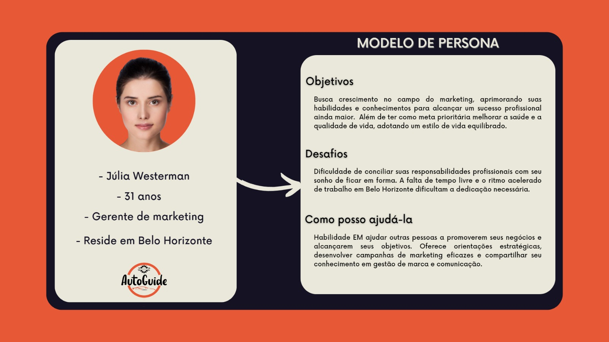

# Informações do Projeto
`TÍTULO DO PROJETO`  

......  AUTOGUIDE ......

`CURSO` 

......  Sistemas de Informação ......

## Participantes

> - Pedro H. Oliveira Siqueira
> - Erick Vieira
> - Marcelo Americano
> - Mathaus Tertulliano
> - Igor Lucas

# Estrutura do Documento

- [Informações do Projeto](#informações-do-projeto)
  - [Participantes](#participantes)
- [Estrutura do Documento](#estrutura-do-documento)
- [Introdução](#introdução)
  - [Problema](#problema)
  - [Objetivos](#objetivos)
  - [Público-Alvo](#público-alvo)
- [Especificações do Projeto](#especificações-do-projeto)
  - [Personas](#personas)
  - [Histórias de Usuários](#histórias-de-usuários)
  - [Requisitos](#requisitos)
- [Projeto da Solução](#projeto-da-solução)
  - [Wireframes](#wireframes)
  - [Mapa de navegação](#mapa-de-navegação)
- [Conclusões](#avaliação-da-aplicação)
  
# Introdução

## Problema

>O problema que nossa aplicação pretende resolver está relacionado ao gerenciamento eficiente da manutenção de veículos, visando atender às necessidades de pessoas que enfrentam dificuldades nesse processo. Identificamos três principais desafios que as pessoas podem enfrentar:

>Inabilidade ou falta de conhecimento: Muitas pessoas podem não ter o conhecimento necessário ou habilidades técnicas para gerenciar adequadamente a manutenção de seus veículos. Isso pode resultar em negligência de tarefas importantes, como troca de óleo, verificação de pneus, alinhamento, entre outras. Essa falta de conhecimento pode levar a problemas mecânicos mais graves no futuro.

>Restrição de tempo: Muitos proprietários de veículos têm vidas ocupadas e não dispõem de tempo suficiente para gerenciar a manutenção regular de seus carros. Essa falta de tempo pode resultar em adiamentos ou até mesmo em manutenções negligenciadas, o que pode levar a falhas e desgaste prematuro de peças.

>Prevenção de manutenções fora do tempo/indevidas: Outro desafio comum é garantir que a manutenção seja realizada dentro dos intervalos corretos e evitando intervenções desnecessárias. Muitas vezes, as pessoas podem não ter um histórico adequado de manutenção do veículo ou podem não estar cientes das diretrizes recomendadas pelo fabricante. Isso pode levar a gastos excessivos com manutenção ou ao não cumprimento das recomendações adequadas.

>É importante ressaltar que, nesse momento, estamos apenas descrevendo os problemas e o contexto em que a aplicação será utilizada, sem entrar em detalhes sobre requisitos específicos ou projetos detalhados.

## Objetivos

......  COLOQUE AQUI O SEU TEXTO ......

>Os objetivos do trabalho são desenvolver um software para solucionar o problema do gerenciamento de manutenção de veículos e criar uma interface amigável para facilitar o uso pelos usuários. Além disso, serão estabelecidos dois objetivos específicos para concentrar e aprofundar as características do trabalho. São eles:

>Desenvolver uma calculadora de aproximação de próxima revisão: O objetivo específico é criar uma funcionalidade na aplicação que, com base nas informações lidas sobre o veículo, calcule uma estimativa de quando deve ser realizada a próxima revisão. Isso será realizado levando em consideração fatores como a quilometragem percorrida, a data da última revisão e as recomendações do fabricante. Essa calculadora auxiliará os usuários a acompanharem o cronograma de manutenção de seus veículos de maneira mais precisa, evitando atrasos ou revisões desnecessárias.

>Aprimorar a usabilidade e a interface do usuário: O objetivo específico é criar uma interface de fácil interpretação e uso para os usuários da aplicação. Serão aplicados princípios de design de interface e usabilidade para garantir que a interação com a aplicação seja intuitiva e agradável. Serão considerados fatores como a organização das informações, a simplicidade das ações e a clareza das orientações. Ao criar uma interface amigável, o objetivo é reduzir a dificuldade enfrentada pelos usuários no gerenciamento de seus veículos, tornando a tarefa mais acessível e menos propensa a erros.

>Esses objetivos específicos complementam o objetivo geral de desenvolver um software para solucionar o problema do gerenciamento de manutenção de veículos, fornecendo funcionalidades específicas e focando na usabilidade e na experiência do usuário.

## Público-Alvo

......  COLOQUE AQUI O SEU TEXTO ......

> O público-alvo da aplicação é composto predominantemente pelo público feminino, com uma média de idade em torno de 30 anos. No entanto, é importante ressaltar que a aplicação não se limitará apenas a esse grupo, podendo ser utilizada por pessoas de diferentes faixas etárias e gêneros.

>Dentro desse público, é importante considerar que algumas pessoas podem apresentar dificuldades ou menor familiaridade com a tecnologia. Especialmente entre os usuários de maior idade, é comum encontrar uma curva de aprendizado maior em relação ao uso de aplicativos e dispositivos eletrônicos. Portanto, é fundamental projetar a aplicação de forma clara, objetiva e de fácil compreensão, levando em consideração a necessidade de facilitar a interação e minimizar possíveis obstáculos.

>Diante dessa análise, o sistema será desenvolvido com uma interface intuitiva, onde a navegação será simplificada e as informações apresentadas de forma clara e objetiva. A linguagem utilizada será acessível, visando facilitar a compreensão e a interação dos usuários. Além disso, a aplicação contará com recursos de suporte e orientações passo a passo para auxiliar os usuários menos familiarizados com a tecnologia.
 
# Especificações do Projeto

......  COLOQUE AQUI O SEU TEXTO ......

> As especificações do projeto levam em conta todos os procedimentos utilizados para definir o escopo e viabilidade do projeto. Abaixo estão algumas das técnicas e ferramentas utilizadas:

>Levantamento de requisitos: Nosso levantamento de requisitos teve como principal fonte as discussões com os stakeholders. Fizemos uma análise da concorrência para estudar o que foi proposto por eles (a concorrência) para "replicar" e melhorar em nosso projeto. A coleta de informações veio principalmente pelo google e com pesquisas de campo realizadas nós mesmos.

>Prototipagem: A ferramenta utilizada para a função de prototipagem do projeto foi o Figma.
>Arquitetura da informação: Organizamos nosso site com uma topologia em árvore, a página se inicia na página home e tem acesso a todas as outras e as mesmas tem acesso a ela, podendo haver ligações entre elas. Utilizamos mais a técnica de tentativa e erro para montar o site.

>Design visual: O design pessoal foi feito utilizando o canvas e ferramentas de edição de imagem como photoshop, IAs também fizeram parte do nosso processo criativo, geramos várias imagens e pegamos aspectos das mesmas. O site segue a mesma paleta de cores utilizada na logo, o que ajuda muito na fluidez visual do site.

>Wireframes: Os wireframes foram feitos usando o Canva, é uma ferramenta muito simples que nos capacitou criar um wireframe minimalista e auto explicativo.

>Testes de usabilidade: Os testes de usabilidade são feitos por nossos scrum masters que analisam e pontuam coisas que faltam ou que acharam interessante no projeto.

## Personas

### Persona 1 &rarr; Júlia Westerman

>Júlia possui 31 anos de idade, mora em Belo Horizonte e trabalha como gerente de marketing a 7 anos, possuindo um salário de 7.135,00. Seu hobbie é viajar para o interior aos finais de semana e fazer caminhadas para ficar em forma, que atualmente é o seu maior sonho

 

### Persona 2 &rarr; Pedro Pascal

>É um jovem de 23 anos que ama carros, está sempre atrás de informações sobre, pretende comprar um em breve e passa grande parte do seu tempo vendo conteúdo sobre. Formou-se recentemente em arquitetura e trabalha como auxiliar de arquiteto, ganhando 2000 reais por mês. Pedro pensa muito no futuro e sonha em ver os frutos do seu trabalho florescendo, no momento isso vem com o seu primeiro carro.

### Persona 3 &rarr; Karine Rezende de Oliveira 

>Karine possui 26 anos, mora em Montes Claros (MG) . Trabalha como Médica e recebe 4.500 por mês. É estudiosa, calma, gosta de viajar, praticar camping e sonha em se especializar em cirurgia pediátrica, além de conhecer o Brasil inteiro e ter sua estabilidade financeira.

#

> Relacione as personas identificadas no seu projeto. Lembre-se que 
> você deve descrever precisamente e de forma personalizada o público alvo do seu projeto. 
> Você pode incluir uma imagem da ficha de persona desenvolvida. 
>
> Para tanto, baseie-se tanto nos documentos disponibilizados na disciplina
> e/ou nos seguintes links:
>
> **Links Úteis**:
> - [Persona x Público-alvo](https://flammo.com.br/blog/persona-e-publico-alvo-qual-a-diferenca/)
> - [O que é persona?](https://resultadosdigitais.com.br/blog/persona-o-que-e/)
> - [Rock Content](https://rockcontent.com/blog/personas/)
> - [Hotmart](https://blog.hotmart.com/pt-br/como-criar-persona-negocio/)
> 
> **Exemplo de Ficha**
> 
 

## Histórias de Usuários

Com base na análise das personas forma identificadas as seguintes histórias de usuários:

|EU COMO... `PERSONA`| QUERO/PRECISO ... `FUNCIONALIDADE`                               |PARA ... `MOTIVO VALOR`                                   |
|--------------------|------------------------------------------------------------------|----------------------------------------------------------|
|Cliente             | Preciso de um sistema que me ajude na manutenção do meu veículo  | Manter a manutenção do veículo em dia                    |
|Cliente             | Posso ter um “histórico” de manutenções do meu veículo           | Para auxiliar em saber o que já foi feito anteriormente  |
|Cliente             | De um sistema objetivo e claro                                   | Para ser simples de consultar e usar no dia-a-dia        |
|Cliente             | De uma forma de fazer login                              | Para salvar meus veículos no histórico     |
|Cliente             | De recomendações de manutenção apra meu veículo                            | Para ter uma direção sobre o que devo fazer relacionado ao defeito ou manutenção preventiva que tenho que fazer     |
|Gestor             | Devo solicitar feedback’s dos usuários para possíveis melhorias/correções  | Para deixar o sistema mais fluido e otimizado   |
|Gestor             | criar outras funções no sistema de forma que atraísse outros usuários que inicialmente não estariam no público-alvo          | Para enriquecer o sistema, podendo assim trazer mais ciência ao cliente sobre o veiculo que o mesmo possuí  |
|Gestor             | criar um sistema de controle de acesso          |  Para permitir que alguns usuários tenham acesso a funcionalidades adicionais |
|Gestor             | Campos de acessos de dados simples e diretos    |  Para ser mais fácil gerenciar as informações do meu site|

> Seguindo o modelo acima, apresente aqui as histórias de usuário que são relevantes para o
> projeto de sua solução. As Histórias de Usuário consistem em uma
> ferramenta poderosa para a compreensão e elicitação dos requisitos
> da sua aplicação. Utilize as personas criadas como atores e, se for o caso, um administrador. 
>
> **Links Úteis**:
> - [Histórias de usuários com exemplos e template](https://www.atlassian.com/br/agile/project-management/user-stories)
> - [Como escrever boas histórias de usuário (User Stories)](https://medium.com/vertice/como-escrever-boas-users-stories-hist%C3%B3rias-de-usu%C3%A1rios-b29c75043fac)

## Requisitos

A tabela que segue apresenta os requisitos funcionais do projeto. 

### Requisitos Funcionais

|ID    | Descrição do Requisito  | Prioridade |
|------|-----------------------------------------|----|
|RF-001| Registro de veículo: Permitir que o usuário registre um veículo, fornecendo informações como modelo, ano, placa e quilometragem inicial. | ALTA | 
|RF-002|Cálculo de aproximação de próxima revisão: Calcular uma estimativa de quando deve ser realizada a próxima revisão com base nas informações fornecidas, como quilometragem atual e data da última revisão.  | ALTA |
|RF-003| Histórico de manutenção: Manter um registro das revisões e serviços de manutenção realizados no veículo, incluindo data, quilometragem, tipo de serviço e observações adicionais. | MÈDIA | 
|RF-004| Recomendações de manutenção: Fornecer recomendações gerais de manutenção com base nas informações do veículo, como intervalos recomendados para troca de óleo, alinhamento, balanceamento, entre outros.| MÉDIA |
|RF-005| Interface amigável: Desenvolver uma interface de usuário intuitiva, com design limpo e organizado, facilitando a navegação e a compreensão das funcionalidades disponíveis. | ALTA | 
|RF-006| 	Facilidade de registro de dados: Tornar o processo de registro de informações sobre o veículo simples e direto, com campos claros e orientações para garantir que todos os dados necessários sejam inseridos.| Alta |
|RF-007|Acesso multiplataforma: Desenvolver a aplicação de forma que seja acessível em diferentes plataformas, como web, dispositivos móveis (Android e iOS) e desktop, para oferecer maior flexibilidade aos usuários. | BAIXA | 
|RF-008| 	Interface responsiva: Desenvolver a aplicação de forma que a interface se adapte a diferentes tamanhos de tela, garantindo uma experiência de uso agradável e consistente em diferentes dispositivos. | ALTA |
|RF-009| 	Login de usuário: Criar um sistema de login para gerenciar os usuários da aplicação, permitindo que cada usuário tenha acesso apenas aos seus veículos. | MÉDIA|
|RF-010| 	Controle de acesso: Criar um sistema de controle de acesso para gerenciar os níveis de acesso dos usuários, permitindo que alguns usuários tenham acesso a funcionalidades adicionais, como a criação de novos usuários. | BAIXA |

> Com base nas Histórias de Usuário, enumere os requisitos da sua
> solução. Classifique esses requisitos em dois grupos:
>
> Lembre-se que cada requisito deve corresponder à uma e somente uma
> característica alvo da sua solução. Além disso, certifique-se de que
> todos os aspectos capturados nas Histórias de Usuário foram cobertos.

# Projeto da Solução

......  COLOQUE AQUI O SEU TEXTO ......
> No projeto de desenvolvimento da aplicação web para gerenciamento de carros, foram utilizadas as seguintes tecnologias e frameworks:

>HTML5 e CSS3: Foram utilizados os padrões HTML5 e CSS3 para estruturar e estilizar as páginas da aplicação, garantindo uma apresentação visual atraente e responsiva.

>JavaScript: A linguagem de programação JavaScript foi utilizada para implementar a lógica de interação e funcionalidades da aplicação no lado do cliente. Com o JavaScript, foi possível validar formulários, manipular dados, realizar cálculos e criar uma experiência de usuário dinâmica.

>Bootstrap: O framework Bootstrap foi adotado para o desenvolvimento do layout responsivo da aplicação. Ele oferece um conjunto de componentes, estilos e utilitários pré-definidos, facilitando a criação de um design moderno e adaptável a diferentes dispositivos.

>Local Storage: A tecnologia Local Storage foi utilizada para armazenar dados localmente no navegador do usuário. Ela permitiu que informações relevantes, como preferências de usuário e dados temporários, fossem mantidas entre as sessões, sem a necessidade de um banco de dados externo.

>jQuery: O framework jQuery foi utilizado para simplificar a manipulação do DOM (Document Object Model) e facilitar a interação com elementos HTML, estilização e tratamento de eventos. Com o jQuery, foi possível realizar operações comuns, como seleção de elementos, animações e requisições AJAX, de forma mais concisa e compatível com diferentes navegadores.

## Wireframes

> Wireframes são protótipos das telas da aplicação usados em design de interface para sugerir a
> estrutura de um site web e seu relacionamentos entre suas
> páginas. Um wireframe web é uma ilustração semelhante ao
> layout de elementos fundamentais na interface.

> **Wireframe página home**
> 

## Mapa de navegação

......  COLOQUE AQUI O SEU TEXTO OU DIAGRAMA DE NAVEGAÇÃO .......

> Inclua uma descrição textual ou um diagrama mostrando, sequencialmente, quais ações
> um usuário deve realizar para utilizar todas as características do seu sistema. 

> **Exemplo de Diagrama (opcional, pode ser em texto)**
> 

# Conclusões

......  COLOQUE AQUI O SEU TEXTO ......

> Até o momento, foi possível avançar na criação da interface da aplicação, estabelecer os requisitos funcionais e iniciar a implementação das funcionalidades principais, como o registro de manutenções e o cálculo de aproximação de revisões. Além disso, foram definidos os perfis de usuários e suas necessidades específicas, o que serviu como base para o design e desenvolvimento da aplicação.

>Em conclusão, o projeto de desenvolvimento da aplicação web para gerenciamento de carros encontra-se em andamento, com avanços significativos na implementação das funcionalidades principais e na criação da interface. Ainda há muito trabalho a ser feito, mas acreditamos que estamos no caminho certo para atingir os objetivos estabelecidos.

